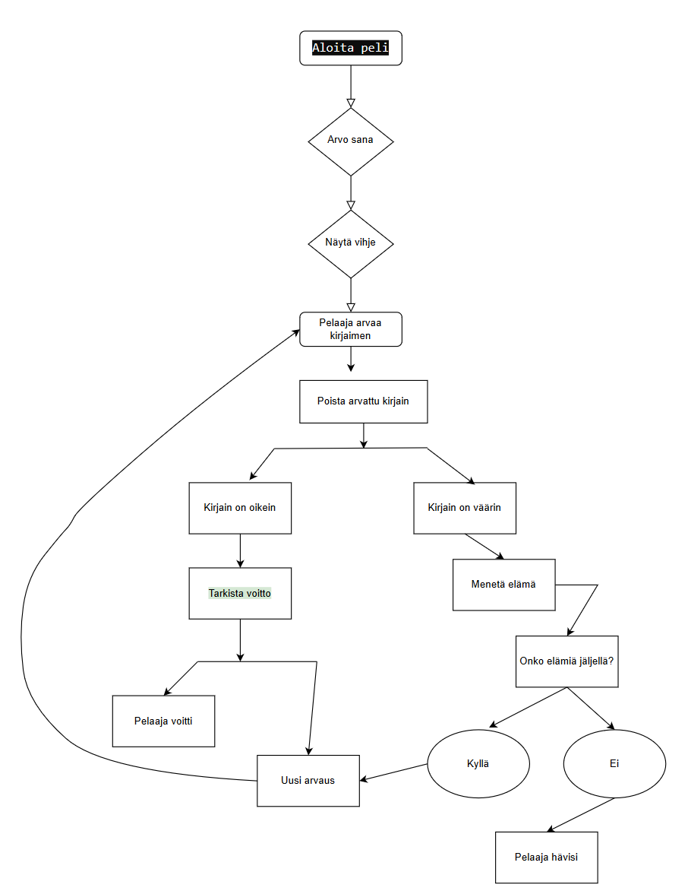

# Hirsipuu

## Pelinkuvaus

Ohjelman lyhyt esittely:
Hirsipuu-peli on interaktiivinen sananselvityspeli, jossa pelaajan tavoitteena on arvata salainen sana kirjain kirjaimelta välttääkseen tikku-ukon ripustamisen hirteen.

### Toiminta

Sovellus arpoo sanan itse tekemästämme sanalistasta
Se näyttää pelaajalle vihjeen salaisesta sanasta viivoina, jotka edustavat kirjaimia.
Pelaaja arvaa yhden kirjaimen kerrallaan.
Jos pelaajan arvaus on oikein, kyseinen kirjain paljastuu salaisessa sanassa.
Jos pelaajan arvaus on väärin, tikku-ukko saa yhden askeleen lähemmäksi hirteen.
Peli päättyy, kun pelaaja arvaa koko sanan tai tikku-ukko päätyy hirteen.

### Toteutus

Teemme ohjelman käyttäen pythonia koodikielenä.
Käytämme silmukkaa pelaajan arvausten käsittelyyn.
Käytämme ehtolauseita oikeiden ja väärin arvattujen kirjainten käsittelyyn.
Käytämme funktioita pelin eri osien toteuttamiseen.

### Ohjelman käynnistäminen

Käynnistysohjeet:

Varmista, että sinulla on Python asennettuna:

Voit ladata Pythonin täältä (https://www.python.org/downloads/) ja asentaa sen käyttöjärjestelmääsi sopivalla tavalla.

Kopioi koodi ja liitä se uuteen tiedostoon. Tallenna tiedosto nimellä hirsipuu.py (tai muulla haluamallasi nimellä).

Avaa komentorivi (Command Prompt, Terminal tai vastaava) ja navigoi hakemistoon, jossa hirsipuu.py sijaitsee.

Suorita skripti komennolla:
python hirsipuu.py

Noudata pelin ohjeita:

Valitse vaikeustaso syöttämällä "helppo", "keski" tai "vaikea".
Arvaa kirjaimia yksitellen kirjoittamalla kirjain ja painamalla Enter.
Voit lopettaa pelin milloin tahansa kirjoittamalla "end".

Nauti hirsipuun pelaamisesta!

